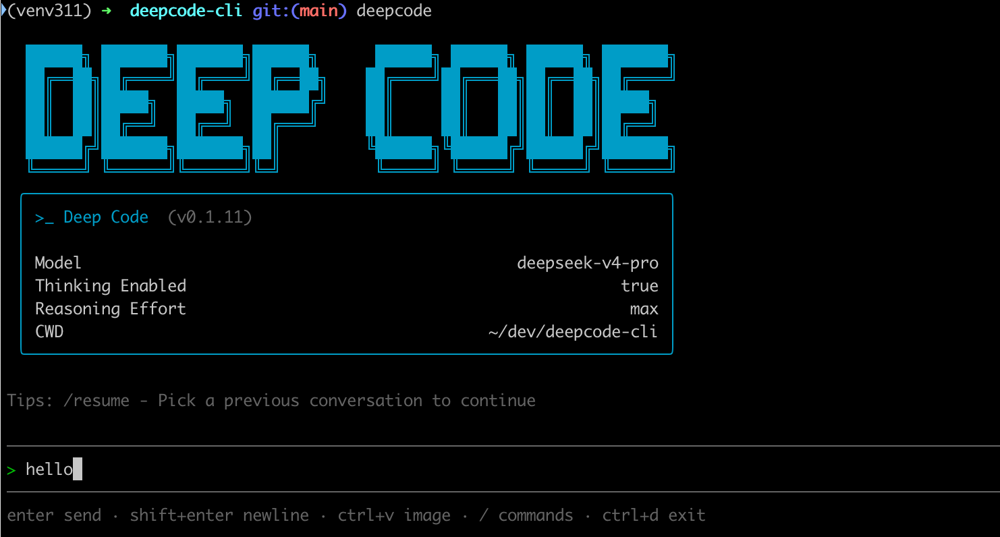

<div align="center">
<br/>
<br/>
<p align="center">
  <a href='https://deepcode.vegamo.cn/'>
    
  </a>
</p>
<h1>Deep Code CLI</h1>

[![][npm-release-shield]][npm-release-link] [![][npm-downloads-shield]][npm-downloads-link] [![][github-contributors-shield]][github-contributors-link] [![][github-forks-shield]][github-forks-link] [![][github-stars-shield]][github-stars-link]
[![][github-issues-shield]][github-issues-link] [![][github-issues-pr-shield]][github-issues-pr-link] [![][github-license-shield]][github-license-link]

English · [中文](./README.md)

<br/>
</div>

[Deep Code](https://github.com/lessweb/deepcode-cli) is a terminal AI coding assistant optimized for the `deepseek-v4` model, with support for deep thinking, reasoning effort control, Agent Skills, and MCP (Model Context Protocol) integration.


## Installation

```bash
npm install -g @vegamo/deepcode-cli
```

Run `deepcode` inside any project directory to get started.



## Configuration

Create `~/.deepcode/settings.json`:

```json
{
  "env": {
    "MODEL": "deepseek-v4-pro",
    "BASE_URL": "https://api.deepseek.com",
    "API_KEY": "sk-..."
  },
  "thinkingEnabled": true,
  "reasoningEffort": "max"
}
```

The configuration file is shared with the [Deep Code VSCode extension](https://github.com/lessweb/deepcode) — configure once, use everywhere.

For complete configuration details (multi-level priority, environment variables, etc.), see [docs/configuration.md](docs/configuration.md).

## Key Features

### **Skills**
Deep Code CLI supports agent skills that allow you to extend the assistant's capabilities:

Skills are discovered from these locations, in priority order:

| Scope   | Path                  | Purpose                       |
| :------ | :-------------------- | :---------------------------- |
| Project | `./.deepcode/skills/` | Deep Code's native location   |
| Project | `./.agents/skills/`   | Cross-client interoperability |
| User    | `~/.deepcode/skills/` | Deep Code's native location   |
| User    | `~/.agents/skills/`   | Cross-client interoperability |

### **Optimized for DeepSeek**
- Specifically tuned for DeepSeek model performance.
- Reduce costs by using [Context Caching](https://api-docs.deepseek.com/guides/kv_cache).
- Natively supports [Thinking Mode](https://api-docs.deepseek.com/guides/thinking_mode) and Effort Control.

## Slash Commands & Keyboard Shortcuts

| Slash Command    | Action                                                  |
|------------------|---------------------------------------------------------|
| `/`              | Open the skills / commands menu                         |
| `/new`           | Start a fresh conversation                              |
| `/resume`        | Choose a previous conversation to continue              |
| `/continue`      | Continue the active conversation or pick one to resume  |
| `/model`         | Switch model, thinking mode, and reasoning effort       |
| `/raw`           | Toggle display mode (Normal / Lite / Raw scrollback)    |
| `/init`          | Initialize an AGENTS.md file (LLM project instructions) |
| `/skills`        | List available skills                                   |
| `/mcp`           | View MCP server status and available tools              |
| `/undo`          | Restore code and/or conversation to a previous point    |
| `/exit`          | Quit (also `Ctrl+D` twice)                              |

| Key              | Action                                                   |
|------------------|----------------------------------------------------------|
| `Enter`          | Send the prompt                                          |
| `Shift+Enter`    | Insert a newline (also `Ctrl+J`)                         |
| `Ctrl+V`         | Paste an image from the clipboard                        |
| `Esc`            | Interrupt the current model turn                         |
| `Ctrl+D` twice   | Quit Deep Code                                           |

## Supported Models

- `deepseek-v4-pro` (Recommended)
- `deepseek-v4-flash`
- Any other OpenAI-compatible model

## FAQ

### Does Deep Code have a VSCode extension?

Yes. Deep Code offers a full-featured VSCode extension, available on the [VSCode Marketplace](https://marketplace.visualstudio.com/items?itemName=vegamo.deepcode-vscode). The extension shares the `~/.deepcode/settings.json` configuration file with the CLI, so you can switch seamlessly between the terminal and the editor.

### Does Deep Code support understanding images?

Deep Code supports multimodal input — you can paste images from the clipboard with `Ctrl+V`. However, `deepseek-v4` does not support multimodal yet. Some models have multimodal capabilities but impose strict limits on multi-turn dialogue requests. For multimodal input, we recommend using the Volcano Ark `Doubao-Seed-2.0-pro` model, which has the best integration.

### How to automatically send a Slack message after a task completes?

Write a shell notification script that calls a Slack webhook, then set the `notify` field in `~/.deepcode/settings.json` to the full path of the script. For detailed steps, see [docs/notify_en.md](docs/notify_en.md).

### How do I enable web search?

Deep Code comes with a built-in, free Web Search tool that works well for most use cases. If you prefer to use a custom script for web search, set the `webSearchTool` field in `~/.deepcode/settings.json` to the full path of your script. For detailed steps, refer to: https://github.com/qorzj/web_search_cli

### Does it support Coding Plan?

Yes. Just set `env.BASE_URL` in `~/.deepcode/settings.json` to an OpenAI-compatible API endpoint. Take Volcano Ark's Coding Plan as an example:

```json
{
  "env": {
    "MODEL": "ark-code-latest",
    "BASE_URL": "https://ark.cn-beijing.volces.com/api/coding/v3",
    "API_KEY": "**************"
  },
  "thinkingEnabled": true
}
```

### How do I configure MCP?

Deep Code supports MCP (Model Context Protocol) to connect external services such as GitHub, browsers, databases, and more. Configure the `mcpServers` field in `settings.json` to enable it, then use the `/mcp` command to view MCP server status and available tools.

For detailed setup instructions, see: [docs/mcp.md](docs/mcp.md)

### How to configure Deep Code to send notifications after a task completes?

When the AI assistant completes a task, Deep Code can automatically execute a notification script to send the task results to the specified channel (e.g., Slack, system notifications, etc.).

For detailed configuration instructions, see: [docs/notify_en.md](docs/notify_en.md)

### Does Deep Code only support YOLO mode?

No. Deep Code has a built-in fine-grained permission control mechanism that lets you confirm operations before the AI assistant executes shell commands, reads/writes files, accesses the network, and more. You can configure each permission scope's policy — always allow, always ask, or deny — via the `permissions` field in `settings.json`. See [docs/permission.md](docs/permission.md) for details.

## Contributing

Contributions are welcome! Here's how to get started:

```bash
# Clone the repository
git clone https://github.com/lessweb/deepcode-cli.git
cd deepcode-cli

# Install dependencies
npm install

# Local development (typecheck + lint + format check + bundle)
npm run build

# Run tests
npm test

# Link globally (local global install)
npm link
```

- Make sure `npm run check` passes before submitting a PR (typecheck + lint + format check)
- We recommend running `npm run format` before building to avoid errors

## Getting Help

- Report bugs or request features on GitHub Issues (https://github.com/lessweb/deepcode-cli/issues)

## License

- MIT

## Support Us

If you find this tool helpful, please consider supporting us by:

- Giving us a Star on GitHub (https://github.com/lessweb/deepcode-cli)
- Submitting feedback and suggestions
- Sharing with your friends and colleagues


<!-- LINK GROUP -->

[npm-release-link]: https://www.npmjs.com/package/@vegamo/deepcode-cli
[npm-release-shield]: https://img.shields.io/npm/v/@vegamo/deepcode-cli?color=4d6BFE&labelColor=black&logo=npm&logoColor=white&style=flat-square&cacheSeconds=1800
[npm-downloads-link]: https://www.npmjs.com/package/@vegamo/deepcode-cli
[npm-downloads-shield]: https://img.shields.io/npm/dt/@vegamo/deepcode-cli?labelColor=black&style=flat-square&color=4d6BFE&cacheSeconds=1800
[github-contributors-link]: https://github.com/lessweb/deepcode-cli/graphs/contributors
[github-contributors-shield]: https://img.shields.io/github/contributors/lessweb/deepcode-cli?color=4d6BFE&labelColor=black&style=flat-square&cacheSeconds=1800
[github-forks-link]: https://github.com/lessweb/deepcode-cli/network/members
[github-forks-shield]: https://img.shields.io/github/forks/lessweb/deepcode-cli?color=4d6BFE&labelColor=black&style=flat-square&cacheSeconds=1800
[github-stars-link]: https://github.com/lessweb/deepcode-cli/network/stargazers
[github-stars-shield]: https://img.shields.io/github/stars/lessweb/deepcode-cli?color=4d6BFE&labelColor=black&style=flat-square&cacheSeconds=1800
[github-issues-link]: https://github.com/lessweb/deepcode-cli/issues
[github-issues-shield]: https://img.shields.io/github/issues/lessweb/deepcode-cli?color=4d6BFE&labelColor=black&style=flat-square&cacheSeconds=1800
[github-issues-pr-link]: https://github.com/lessweb/deepcode-cli/pulls
[github-issues-pr-shield]: https://img.shields.io/github/issues-pr/lessweb/deepcode-cli?color=4d6BFE&labelColor=black&style=flat-square&cacheSeconds=1800
[github-license-link]: https://github.com/lessweb/deepcode-cli/blob/main/LICENSE
[github-license-shield]: https://img.shields.io/github/license/lessweb/deepcode-cli?color=4d6BFE&labelColor=black&style=flat-square&cacheSeconds=1800
